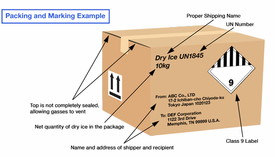

# 5 Shipping research samples

## 5.1 Check list for research sample transport

Go through this step-by-step check list for shipping research samples along the key questions.

This check list is only for internal use, based on experience and no official guideline from one of the authorities! There might be changes and or inaccuracies. Always contact the responsible institutions and authorities if you have questions (some contact information is noted below).

### 5.1.1 Before transport

Prepare everything early! Apply for all permits **at least** 5 weeks before the transport!

Consider 6 different checks **BEFORE** shipping in this order:

- **EU commercial document** (why?: complementary/basis for permits/declaration) → 5.1.1.1
- **CITES** (why?: permission for international trade of protected species) → 5.1.1.2
- **Ruokavirasto / Finnish Food Authority** (why?: veterinarian import permit) → 5.1.1.3
- **Customs** (why?: border control, import formalities, import duties) → 5.1.1.4
- **Storage temperature during transport** (why?: secure the preservation of the genetic material) → 5.1.1.5
- **Courier & airline regulations** (why?: security regulations for transport) → 5.1.1.6

**Note:** try to use the same addresses of the consignor (sender) and consignee (you) on all the documents. Use the registed addresses from the CITES permits and/or import pemits from Ruokavirasto (Finnish Food Authority).

---
#### **5.1.1.1 EU commercial document**

The **EU commercial document 142/2011 (2019/1084) Animal by-products/derived products not intended for human consumption** is needed for any transport of zoological research samples and is a basis/accompanying for permits and further documentation.

Complete the EU commercial document: 
https://www.ruokavirasto.fi/globalassets/tietoa-meista/asiointi/oppaat-ja-lomakkeet/elaimet/sivutuotelomakkeet/commercial-document_traces.pdf

EU commercial document (at least) must include (recommended by Ruokavirasto (Finnish Food Authority)):

- Description of material and original species  
- Category of material (blood = **category 3**, faeces = **category 2**)  
- Samples must be marked: "***for research and diagnostic purposes***"
- Quantities of samples
- Place of origin and dispatch of the material
- Sender's name and address  
- Recipient name and address (NOTE: Please use the registration ID: **Oulun yliopisto, FI-EVIRA-OTH-1-2025**)

It has to be signed by the the responsible person of place of origin (of the sample(s))!

The commercial document must be drawn up in at least three copies (original copy and two copies). The original shall accompany the consignment to its final destination. The receiver must keep it to himself. The consignor and the transport operator shall each retain one copy. Commercial documents must be kept for at least two years in order to be presented to the competent authority.

Keep the documents! You find the **"Legal Documents" folder** in the **BioDiv Genomics lab bay**.

---

#### **5.1.1.2 CITES**
**CITES** = acrynym for the **Convention on International Trade in Endangered Species of Wild Fauna and Flora**, also known as the **Washington Convention**

##### **5.1.1.2.1 CITES-listed taxon?**
Please check if the taxon you want import samples from is listed under **Appendix I or II (or rarely Appendix III)**!

→ Check at ***Species+***: https://www.speciesplus.net/

Yes

###### **5.1.1.2.1.1 Faecal or urine samples of CITES-listed taxon?**

Yes

**No** CITES permits are needed.

All derivates from a listed organism that was taken from the individual are needed to be permited (including DNA/RNA extracts or other molecular derivates!). Faecal or urine samples are considered as leftovers/not part of the body and not as a “specimen” that would need CITES permits.

 

No

###### **5.1.1.2.1.1.1 CITES permits needed, but samples from institution with CITES registration/accreditation?**

→ Check here: https://cites.org/eng/common/reg/si/summary.html

Yes

Scientific exchange exemption and simplified CITES procedure possible.

Between **CITES-registered scientific institutions** there is a simpler permit process possible, which includes just one permit document: ***Certificate for international exchange between registered scientific institutions entitled to the exemption provided by Article VII, paragraph 6, of the CITES***

Our CITES resgistration (https://cites.org/eng/node/11481):

> **Institution number:** FI 010
>
>**Country**: Finland  
>  
> **Institution type**: Register of scientific institutions  
>  
> **Address**:  
> University of Oulu,  
> Biodiversity Unit / Zoological Museum,  
> Contact person: Tuula Pudas,  
> P.O. Box 3000,  
> FI-90014 University of Oulu  
>  
> **Email**: [tuula.pudas@oulu.fi](mailto:tuula.pudas@oulu.fi)  
>  
> **Website**: [https://www.oulu.fi/fi/tutkimus/tutkimusinfrastruktuurit/biodiversiteettiyksikko](https://www.oulu.fi/fi/tutkimus/tutkimusinfrastruktuurit/biodiversiteettiyksikko)

Keep the documents! You find the **"Legal Documents" folder** in the **BioDiv Genomics lab bay**.

 

No

Application for **CITES export** (from the country of origin) and **CITES import** (to the country you want to import to; if to our lab it would be Finland) permits is needed (including DNA/RNA extracts or other molecular derivates!).

The authority for **CITES import permits for Finland is SYKE**.

Contact your collaboration partner for their local authority for the CITES export permition.

Keep the documents! You find the **"Legal Documents" folder** in the **BioDiv Genomics lab bay**.

 

No

**No** CITES permits are needed.

---

#### **5.1.1.3 Ruokavirasto / Finnish Food Authority**

##### **5.1.1.3.1 Import from EU country, Switzerland, or Norway?**

Yes

**No** veterinarian import permit from Ruokavirasto (Finnish Food Authority) is needed. 

The Finnish Food Authority has registered the **University of Oulu (Oulun yliopisto, FI-EVIRA-OTH-1-2025)** as an operator using animal by-products in research. No other authorization from the Finnish Food Authority in the internal market.

Contact the **ABP (Animal By-Products) division at Ruokavirasto (Finnish Food Authority)** if you have questions from EU countries, Switzerland, or Norway: abp@ruokavirasto.fi

 

No

Import permit from Ruokavirasto (Finnish Food Authority) is needed.

Application form:  
https://link.webropolsurveys.com/S/1613FC7408EFF0A5

>**Examplary application for import permit:**
>
>Adjust the applicant, phone number and your email address. Check if the **billing liaison (University of Oulu)** and the **local veterinarian supervisor** are still currently in charge!
>
>University of Oulu registration: **Oulun yliopisto, FI-EVIRA-OTH-1-2025**
>
>
>
>
>

Webpage with more information:  
https://www.ruokavirasto.fi/en/themes/import-and-export/import/animals-and-animal-products/animal-by-products/elainperaisten-naytteiden-seka-nayttelyesineiden-tuonti/

Contact the **Ruoka Tuontilupa (Food Import Permit) division at Ruokavirasto (Finnish Food Authority)** if you have questions: tuontilupa@ruokavirasto.fi

Keep the documents! You find the **"Legal Documents" folder** in the **BioDiv Genomics lab bay**.

---

#### **5.1.1.4 Customs**

##### **5.1.1.4.1 Tulli / Finnish Costums**

You need to declare the research samples at Finnish Customs (Tulli) for the import to Finland.

###### **5.1.1.4.1.1 *pro forma* invoice / donation receipt**
First, The ***pro forma* invoice / donation receipt** for the samples has to be issed by the former owner of the samples. Its hould contain:
- Sender's name and address
- Recipient name and address (include registration ID)
- Issue date
- Description of material and original species
- Quantity of each sample type per species
- nominal value for each samples type (**10 €** is a appropriate symbolic value for customs declaration only)
- the follwoing description; everything in [  ]you need to check and insert:
    > "**This is a nominal valuation for Customs purpose only, The samples described above are provided for research purposes only from [*OWNER/COLLABORATION PARTNER*]. This transaction is conducted without any commercial purpose. As listed above, a value of [*VALUE*] can be placed on the consignment for Costums purposes only if required. Incoterm: EXW; Tariff Number 05.11.9985 [*please check under: https://www.tariffnumber.com/2026/05; also check for different number outside of the EU*]; samples for research not infectious material biological substance, category B UN3373**"
- signiture by the owner / a respondsible person with the affilation of the owning institution

###### **5.1.1.4.1.2 Custom declaration forms**

Even though not necessary in every case, always prepare the following forms and send them for a customs clearance decision before transport together with **(1) CITES permites** (if needed), **(2) import permit from Ruokavirasto/Finnish Food Authority** (if needed), the **(3) EU commercial document**, and a **(4) *pro forma* invoice** or a **donation receipt** from the : 
- **976e_25 Report of intended use:**  
  https://tulli.fi/documents/162752825/203342722/Report%20of%20intended%20use/5bdad5bd-18f4-4e78-cc60-70eaa9620c0e/Report%20of%20intended%20use.pdf

- if you transport the samples yourself: **1143e_10.2025 Private person’s declaration of goods imported from outside the customs and fiscal territory of the EU:**  
  https://tulli.fi/documents/162752825/203342719/Private+person%E2%80%99s+declaration+of+goods+imported+from+outside+the+customs+and+fiscal+territory+of+the+EU.pdf

Send those completed forms to the following adresses for the **clearance decision**:
- if the samples are with the researcher as luggage: lentovalvonta@tulli.fi (Cc Jaana Mikkonen: jaana.mikkonen@tulli.fi)

- if the samples come as cargo, the courier or the university must do the customs clearance
assignment to a courier

Print out the ***pro forma* invoice/donation receipt**, those **completed forms** and the **customs clearance decision** four times for the sender, receiver, transport operator, and potentially for the Finnsih customs on location.

If you have questions regarding customs documention and clearance contact Jaana Mikkonen: jaana.mikkonen@tulli.fi

Keep the documents! You find the **"Legal Documents" folder** in the **BioDiv Genomics lab bay**.

###### **5.1.1.4.1.3 Consider before booking flight tickets**

If you transport the samples on your own:
- **You have to declare the samples the first time you enter Finland.** If you have a transition at e.g. Helsinki on your way to Oulu: you have to go to Tulli at Helsinki airport at to declare them. You can reach the Helsinki Tulli counter from *International Transit Area* within the airport without the need to be security-checked again close to the gates 29 / 30 (https://www.finavia.fi/en/airports/helsinki-airport/airport/services-facilities/customs-0). If nowbody is in the counter ring the bell on the right side of the counter. Tulli staff is 24/7 available.
- **Consider a considerable transit time between the flights durig booking tickets.** You have to go to the counter and there might be a queue. 30 - 60 hours between entereing the airport and boarding is neeed at least. The times at your tickets are the times for the plane's arrival and departure and not the times you enter the airport or boarding for the next flight! Boarding closes normally latest 15 minutes before departure.

---

### 5.1.1.5 Storage temperature during transport
#### 5.1.1.5.1 Do your samples have to be frozen or cooled?

Yes

You need to **choose a refrigerant / coolant** for your sample transport.

Generally, schedule the transport of frozen samples in **winter** if possible. Higher ambient temperatures influence cooling effect.

Use **expanded polystyrene (EPS; 'styrofoam') boxes** as the cooling container anyway.

Coolants: **dry ice** or different types **cooling packs**.

| **Coolant Type**                                  | **Maintains −20 °C in general?** | **Hours of cooling (with temperature range)** | **Commentary**                                                                                                               |
| ------------------------------------------------- | -------------------------------- | --------------------------------------------- | ---------------------------------------------------------------------------------------------------------------------------- |
| Water-based ice packs                             | ❌ No                             | 4–8 h (around 0 °C → gradually rising)                  | Will not maintain frozen state. Samples will begin thawing quickly.                                                          |
| Gel refrigerant packs (0 °C type)                 | ❌ No                             | 6–12 h (0 °C to +5 °C typical range → gradually rising)          | Designed for refrigerated shipping, not frozen transport.                                                                    |
| Deep-Frozen Gel Packs (−20 °C rated)                            | ⚠ Partially                      | ~6–18 h (starts at −20 °C → gradually rising) | Frozen gel packs that start at −20 °C but temperature rises steadily, may allow partial thawing for long durations.      |
| PCM sheets (0 °C phase change; e.g. ThermaFreeze) | ❌ No                             | 8–24 h (stable around 0 °C)                   | Maintains a constant 0 °C; not suitable for −20 °C.                                                                          |
| −20 °C PCM panels                                 | ✅ Yes                            | ~12–36 h (astable round −20 °C if properly packed)   | Suitable for maintaining frozen samples during overnight/express shipment. Duration depends heavily on insulation and load.  |
| Dry ice                                           | ✅ Yes (well below −20 °C)        | 24–72 h (around −78.5 °C → gradually warming) | **Most reliable for frozen transport.** Duration depends heavily on insulation and load. Read below: **5.1.1.5.1.1 Dry ice** |

##### **5.1.1.5.1.1 Dry ice** 

**Dry ice** is solid carbon dioxide **(UN 1845 Class 9 *Miscellaneous Dangerous Good*)**.

The sublimation temperature of dry ice is **−78.5 °C**
(−109.3 °F) at normal atmospheric pressure (1 atm), therefore the **best method to keep samples frozen** and is highly recommendable especially if:

- high quality samples for genomic applications (e.g. blood, tissue, etc.)
- utilising a courier  
- longer or non-express shipments 
- valuable or irreplaceable samples  

Rule of thumb: the **cooling effect** of dry ice of 9 kg of dry ice lasts approximately three to four days. Around 15 – 30 % sublimates within the first 24 hours, depending on the amount of dry ice used. For a basic shipment, 10–15 kg is recommendable depending on sample amount.

Contact your collaboration partner for **local distributers** for dry ice to ensure the fast transport of it to the samples before shipment. **The dry ice delivery and the sample shipment have to be well scheduled.** Account for the loss of dry ice during the transport to the samples. Help your collaboration partner if they do not have contact to a distributer for dry ice to find one.

→ See **5.1.1.6.1.4.2** how to properly pack and declare samples transported with dry ice!

**5.1.1.5.1.2 Cooling packs**

Cooling packs have, depending on their type (see table above) lower cooling capacities. So, they can be feasible for samples that just have to be cooled or for short transports of frozen samples depending on the cooling pack type:

Gel refrigerant packs/Gel ice packs and Phase change material (PCM) panels/PCM sheets are available in different temperature ratings and phase-change temperatures, respectively. There are certified –20 °C gel and PCM packs.

>**Tutorial video for ThermaFreeze:** 
>
>

 

No

Short summary for transport at room temperature (RT; ~+21 °C):

Tested and recommended alternative sample preservatiuons without the need of a cooling chain that you can prepare: 

**5.1.1.5.1.3 Biological liquids (e.g. blood, saliva, urine, cloacal, etc.):**
- **Swab samples** (saliva, urine, cloacal, etc.): in a **plastic zip-lock bag** with a **silica gel desiccant sachet** (avoid "free" silica gel since silica has binding properties for DNA); put the swab(s) into a folded filter paper within the plastic bag
- **FTA® cards** (blood)

**5.1.1.5.1.4 Hair (with follicles), feathers, or dried leaves or tissue (incl. museum specimen):**
- in a **plastic zip-lock bag** with a **silica gel desiccant sachet** (avoid "free" silica gel since silica has binding properties for DNA); put the hair(s)/feather(s)/dried tissue into a folded filter paper within the plastic bag

**5.1.1.5.1.5 Faeces**

Depends in the faecal consistancy; **container with EtOH** were successfully tested for larger mammals (carnivores and bovids) and giant tortoises; plastic **bag with silica gel** are successfully tested for flying squirrel droppling (faecal pellets).

- **Container with 95-100 % EtOH**: use multi-purpose container with a srew cap (max. volume: 70 ml, (LxØ): 55 x 44 mm, graduated, PP, transparent) from SARSTEDT; add 33 ml 95 - 100 % EtOH - if the sample is not covered add EtOH; optimal for backup samples; tip especially for transport: avoid EtOH in container thread during sample collection because it can lead to leaking liquids; otherwise safe; depending on the faecal water content the dehyration effect differs because the EtOH gets diluted
- in a **plastic zip-lock bag** with a **silica gel desiccant sachet** (avoid "free" silica gel since silica has binding properties for DNA); put the faecal pellets into a folded filter paper within the plastic bag

---

### 5.1.1.6 Courier & airline regulations
#### 5.1.1.6.1 Do you utilise a courier service?

Yes

Make sure to clarify all the needed details described below with the parcel senders and parcel receivers **befrore** scheduling with the courier service.

##### **5.1.1.6.1.1 Contact with sender**
Mostly the parcel has to be ready for shipment before the courier will receive it. You have to **clarify first with your collaboration partner** if they are able to prepare the sample shipment appropriately if you are not yourself at the location from where the parcel will be shipped.

You need at least a **contact person** on time/location (that will hand over the parcel to the courier) and their (mobile) **phone number** for the courier. The courier also needs an **exact address for picking up the parcel**. Make sure with your collaboration partner if the address for picking up the parcel differs from the "general" address of the institution.

##### **5.1.1.6.1.2 Contact with courier service**
Contact your courier service and clarify:
- what the **nature of the shipment** (so that they are aware of the content, will confirm that they handle those kinds of shipments, and the courier itself can handle it accordingly)
  - **biological samples** with all the permits etc.
    - Our research samples are non-infectious (e.g., they are simply faecal samples stored in ethanol that do not contain harmful pathogens); **UN3373 Category B** does apply.
  - clarification of the containment of **dry ice (UN 1845 Class 9 *Miscellaneous Dangerous Good*)** and/or **ethanol** (containing >24% ethanol; **UN1170 Class 3 *Flammable Liquid*)** 
  - Use of a **EPS/styrofoam box** as the cooling container (instead of a 'dry shipper')
  - **total weight**
  - **parcel dimensions**
  - **net quantity of dry ice** (Clarify with the courier service that the parcel containing dry ice loses weight over time, which can cause problems for declaration.)
  - the courier service might have more questions

- the **price under the needed conditions** (shipping duration, weights, size, temperatures, etc.)
- if they need any **additional documentation** from you other than what is described above
- if the courier does the **customs clearance assignment** or if you have to do it
- exact time for picking up the parcel (schedled with the contact person on location)

Especially the cooled shipments are expensive. It is worth it to check several courier services. We used those courier services already:
- DHL
- GO! Express & Logistics Düsseldorf GmbH: https://www.general-overnight.com/deu_en/products/go-express.html

##### **5.1.1.6.1.3 Receiving parcel**

Make sure that you or a colleague is available (also at phone) and on the scheduled time/location to pick up the sample (especially if the samples have to be frozen in the lab). Let the the person in the lab know where to store the samples. Soile Alatalo (laboratory manager; soile.alatalo@oulu.fi) will happly help you. If it is outside of her working hours you have to find another comtact person to receive the parcel.

 

No

A **self-transport** is sometimes more safe and even cheaper instead of utilising a courier service even if flights are needed.

##### **5.1.1.6.1.4 Airline regulations**
If you transport the samples yourself you have to get into contact with the airlines you utilise.

Consider the allowed dimension measures for the cooling box as carry-on baggage:
- Carry-on bag (55cm x 40cm x 23cm)
- Small bag (40cm x 30cm x 15cm)
- 7 - 10 (sometimes 12) kg total weight for all carry-on combined

Consider all your other (private) carry-on baggage in those allowances. If using dry ice as a coolant, the cooling box normally needs to be placed under the seat and therefore have to meet the measures of a small bag (40cm x 30cm x 15cm). We have a EPS box with a blue handle with those measures in the BioDiv Genomics lab bay available.

Always check those measures with the airlines and book the flight tickets accordingly!

Carry-on baggage allowance for **Finnair**:
| Ticket type             | Carry-on bag (55cm x 40cm x 23cm) | Small bag (40cm x 30cm x 15cm) | Maximum combined weight |
|-------------------------|-----------------------------------|--------------------------------|-------------------------|
| **Business Flex**        | 1 PC                              | 1 PC                           | Total weight 12kg       |
| **Business Classic**     | 1 PC                              | 1 PC                               | Total weight 12kg                        |
| **Business Light**       | 1 PC                              | 1 PC                               | Total weight 12kg                        |
| **Premium Economy Flex** | 1 PC                              | 1 PC                               | Total weight 8kg        |
| **Premium Economy Classic** | 1 PC                           | 1 PC                               | Total weight 8kg                                |
| **Premium Economy Light** | 1 PC                             | 1 PC                               | Total weight 8kg                                |
| **Economy Flex**         | 1 PC                              | 1 PC                               | Total weight 8kg                                |
| **Economy Classic**      | 1 PC                              | 1 PC                               | Total weight 8kg                                |
| **Economy Light**        | 1 PC                              | 1 PC                               | Total weight 8kg                                |
| **Economy Superlight***   | 0 PC                              | 1 PC                               | Total weight 8kg                                |
*If your ticket type is Superlight, you can purchase a carry-on bag as a travel extra.

###### **5.1.1.6.1.4.1 Biological samples**
Our research samples are non-infectious (e.g., they are simply faecal samples stored in ethanol that do not contain harmful pathogens) and have to be lablled as **UN 3373 Category B**: https://www.ruokavirasto.fi/globalassets/laboratoriopalvelut/elaintautitutkimukset/pakkausohjeet/tulostettava-un-3373-merkki.pdf

###### **5.1.1.6.1.4.2 Dry ice**
Maximal **2.5 kg of dry ice is allowed as carry-on or checked baggage** if labelled (**UN 1845 class 9 '*Miscellaneous Dangerous Good*'**). Follow the **IATA Dangerous Goods Regulations**: "*Dry ice (carbon dioxide, solid), in quantities not exceeding 2.5 kg per person when used to pack perishables not subject to these Regulations in checked or carry-on baggage, provided the baggage (package) permits the release of carbon dioxide gas. Checked baggage must be marked “dry ice” or “carbon dioxide, solid” and with the net weight of dry ice or an indication that there is 2.5 kg or less dry ice*"

**(1)** Verify the allowance of 2.5 kg with the airlines before booking. In case ther airline as the operator does not allow it! Consider the baggage allowances when flying with several airlines!

**(2)** Book your ticket and then inform your airline with you booking number about the dry ice in you baggage. Ask for a clearence document and print it - airport staff might already ask you for allowence before boarding.

**Note:** Consider that your checked baggage could get lost during transit. It is advisable to transport the samples as carry-on baggage if the coolant will not last for the entire scheduled travel duration.

###### **5.1.1.6.1.4.3 Cooling packs**

If transporting as carry-on baggage consider the following regulations:

- Max. 100 ml per cooling pack and sample!
- Total liquid volume per person: 1 liter (including samples and all the other liquids the person carries (applies even to solid frozen liquids!))

###### **5.1.1.6.1.4.4 Other hazardous substances**
Check other hazardous substances contained with your samples with the airline and based on the national regulations relevant for your transport.

**Ethanol** (Ethyl alcohol) or Ethanol solutions (containing >24% ethanol) are classified by the **International Air Transport Association (IATA)** as **UN 1170**, a **Class 3 Flammable Liquid**. It is considered a hazardous material for air transport due to its high flammability and potential to create explosive vapor-air mixtures.

Follow the instructions of the **IATA (International Air Transport Association)** for packing: https://www.iata.org/contentassets/b08040a138dc4442a4f066e6fb99fe2a/dgr-67-en-pi650.pdf

Complete and print the **Shipper's Declaration**: https://www.iata.org/contentassets/a9f496cd8c87466b98142fa6d4cdb209/shippers-declaration-open-format-non-fillable.pdf

---

### 5.1.1 Ready for research sample transport 
#### **5.1.1.1 Paper work check list**

The courier or person that transports must have all the original documents listed below. Print copies for the sender, courier/transport operator, receiver, and each customs office where declarations are required. The set of originals should always accompany the samples, along with at least four sets of copies in total. Most of the copies you will not need anymore but ensure that everybody involved has the full set of documentation:

- **EU Commercial document**
- **CITES permits** (if needed)
- **Import permit from Ruokavirasto (Finnish Food Authority)** (if needed)

- ***pro forma* invoice** or a **donation receipt** from owner
- Completed **Report of intended use** (**976e_25**; for Tulli)
-  Completed **Private person’s declaration of goods imported from outside the customs and fiscal territory of the EU** (**1143e_10.2025**; for Tulli; if you transport the samples yourself)
- Completed declaration for courier (if utilising a courier service; communicated with courier beforehand; for Tulli)
- **Clearance decision** from Tulli
- Completed **Shipper's Declaration** (include if necessary **biological samples (UN 3373 Category B)**, **dry ice (UN 1845 Class 9 *Miscellaneous Dangerous Good*)**, **> 24 % ethanol (UN 1170 Class 3 *Flammable Liquid)***)

#### **5.1.1.2 Preparing the samples for transport**

**Packing samples for transport in RT:**
- Put all containers with liquid in at least two water-prove bags (e.g. zip-lock).

- Stick the following lables well visible on the outer back or package (if needed):
  - Biological samples (**UN 3373 Category B**: https://www.ruokavirasto.fi/globalassets/laboratoriopalvelut/elaintautitutkimukset/pakkausohjeet/tulostettava-un-3373-merkki.pdf)

  - over 24 % ethanol (**UN 1170 Class 3 *Flammable Liquid***)

**Packing the samples in a cooling box:**

Follow the instructions of the **IATA (International Air Transport Association)** for packing with dry ice: https://dess.uccs.edu/sites/g/files/kjihxj1296/files/inline-files/IATA_pack_instr_954.pdf

**Note on graphic:** There are combined labels for **UN Number** and **Class 9 Label**: https://www.fedex.com/content/dam/fedex/us-united-states/services/Dry_Ice_Label.pdf
- Use **expanded polystyrene (EPS; 'styrofoam') boxes** as the cooling container in anyway. Thick insulated container (EPS 30–40 mm wall) are recommended.

- Put a layer of tissue and coolant on the bottom of the cooling box.

- Then put the open cooling box at least the night before in -20 °C if possible.

- Always consider cooling box size vs. refrigerant mass ratio! There should be much more coolant around the samples. The coolants have to surround the samples. 

- Put more coolant above samples (2/3). Colder air in the box will go down.

- Stick the following lables well visible on the outer box (if needed):
  - Biological samples (**UN 3373 Category B**: https://www.ruokavirasto.fi/globalassets/laboratoriopalvelut/elaintautitutkimukset/pakkausohjeet/tulostettava-un-3373-merkki.pdf)
  - Dry ice (**UN 1845 Class 9 *Miscellaneous Dangerous Good***: https://www.fedex.com/content/dam/fedex/us-united-states/services/Dry_Ice_Label.pdf)
  - over 24 % ethanol (**UN 1170 Class 3 *Flammable Liquid***)

---

> **Biodiversity Genomics Goup**
> Ecology and Genetics Research Unit,
> University of Oulu, Finland
>
> https://biodiversitygenomics.org/
>
> biodiversity.genomics@oulu.fi

Version 1.0: Gerrit Wehrenberg, 28.02.2026

---