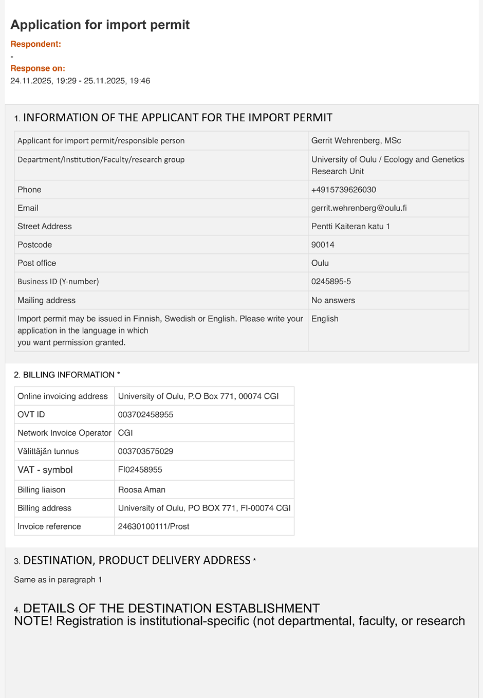
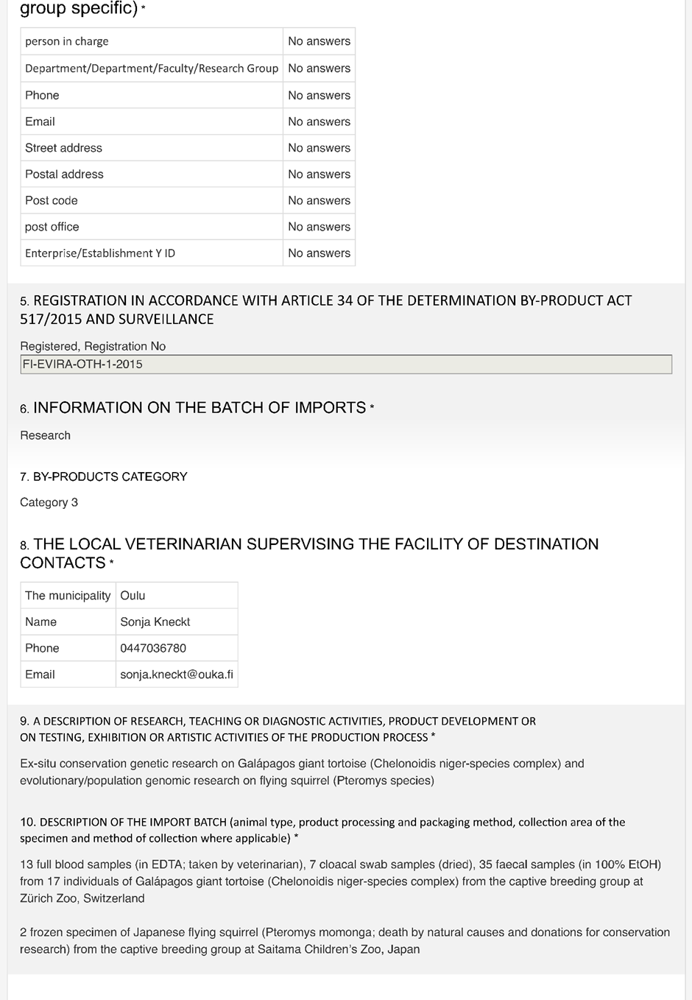
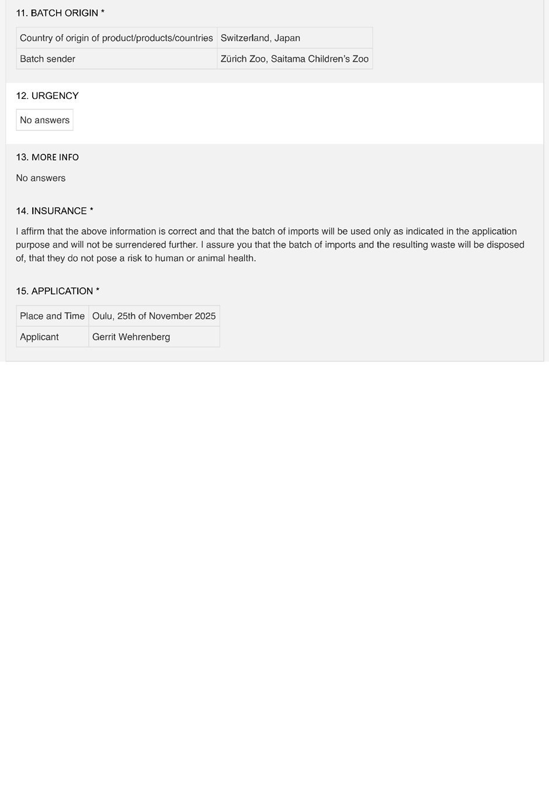

# 5 Shipping research samples

## 5.1 Check list for research sample transport

Go through this step-by-step check list for shipping research samples along the key questions.

This check list is only for internal use, based on experience and no official guideline from one of the authorities! There might be changes and or inaccuracies. Always contact the responsible institutions and authorities if you have questions (some contact information is noted below).

### 5.1.1 Before transport

Prepare everything early! Apply for all permits **at least** 5 weeks before the transport!

Consider 6 different checks **BEFORE** shipping in this order:

- **EU commercial document** (why?: complementary/basis for permits/declaration) → 5.1.1.1
- **CITES** (why?: permission for international trade of protected species) → 5.1.1.2
- **Ruokavirasto / Finnish Food Authority** (why?: veterinarian import permit) → 5.1.1.3
- **Customs** (why?: border control, import formalities, import duties) → 5.1.1.4
- **Storage temperature during transport** (why?: secure the preservation of the genetic material) → 5.1.1.5
- **Courier & airline regulations** (why?: security regulations for transport) → 5.1.1.6

**Note:** try to use the same addresses of the consignor (sender) and consignee (you) on all the documents. Use the registed addresses from the CITES permits and/or import pemits from Ruokavirasto (Finnish Food Authority).

---
#### **5.1.1.1 EU commercial document**

The **EU commercial document 142/2011 (2019/1084) Animal by-products/derived products not intended for human consumption** is needed for any transport of zoological research samples and is a basis/accompanying for permits and further documentation.

Complete the EU commercial document: 
https://www.ruokavirasto.fi/globalassets/tietoa-meista/asiointi/oppaat-ja-lomakkeet/elaimet/sivutuotelomakkeet/commercial-document_traces.pdf

EU commercial document (at least) must include (recommended by Ruokavirasto (Finnish Food Authority)):

- Description of material and original species  
- Category of material (blood = **category 3**, faeces = **category 2**)  
- Samples must be marked: "***for research and diagnostic purposes***"
- Quantities of samples
- Place of origin and dispatch of the material
- Sender's name and address  
- Recipient name and address (NOTE: Please use the registration ID: **Oulun yliopisto, FI-EVIRA-OTH-1-2025**)

It has to be signed by the the responsible person of place of origin (of the sample(s))!

The commercial document must be drawn up in at least three copies (original copy and two copies). The original shall accompany the consignment to its final destination. The receiver must keep it to himself. The consignor and the transport operator shall each retain one copy. Commercial documents must be kept for at least two years in order to be presented to the competent authority.

Keep the documents! You find the **"Legal Documents" folder** in the **BioDiv Genomics lab bay**.

---

#### **5.1.1.2 CITES**
**CITES** = acrynym for the **Convention on International Trade in Endangered Species of Wild Fauna and Flora**, also known as the **Washington Convention**

##### **5.1.1.2.1 CITES-listed taxon?**
Please check if the taxon you want import samples from is listed under **Appendix I or II (or rarely Appendix III)**!

→ Check at ***Species+***: https://www.speciesplus.net/
> 

> 
🟢 Yes

>
> ###### **5.1.1.2.1.1 Faecal or urine samples of CITES-listed taxon?**
>
>> 

>> 
🟢 Yes

>>
>> **No** CITES permits are needed.
>>
>> All derivates from a listed organism that was taken from the individual are needed to be permited (including DNA/RNA extracts or other molecular derivates!). Faecal or urine samples are considered as leftovers/not part of the body and not as a “specimen” that would need CITES permits.
>>
>> 

>
>>
>> 

>> 
🔴 No

>>
>> ###### **5.1.1.2.1.1.1 CITES permits needed, but samples from institution with CITES registration/accreditation?**
>>
>> → Check here: https://cites.org/eng/common/reg/si/summary.html
>>
>>> 

>>> 
🟢 Yes

>>>
>>> **Scientific exchange exemption (SEE)** and simplified CITES procedure possible if the conditions descriped in Table 1 are met.
>>>
>>>> **Table 1:**
>>>
>>> | **Types of specimens that can be exchanged under the exemption are:** | **Types of specimens that cannot be exchanged under the exemption include:** |
>>> | --- | --- |
>>> | Herbarium specimens (e.g. dried or pressed plants and flowers)  | – |
>>> | Preserved, dried or embedded museum animal or plant specimens | Any specimens that are not first catalogued and registered in the collection of a registered institution (e.g.: fresh blood, sera or semen samples, or specimens collected by field researchers) |
>>> | Non-live animal specimens | Live animal specimens |
>>> | Live plant material | – |
>>> | Frozen museum specimens (e.g. frozen tissue samples) | – |
>>> | Forensic research specimens of the examples of types included in the Annex to Resolution Conf. 11.15 (Rev. CoP18) (non-exhaustive list) | Enforcement specimens that are the subject of an ongoing criminal investigation and which may therefore not legally be exchanged |
>>> | Diagnostic samples of the types listed in Annex 4 to Resolution Conf. 12.3 (Rev. CoP18) | – |
>>>
>>> ###### **5.1.1.2.1.1.1.1 You want to import research samples to Finland?**
>>>
>>>> 

>>>> 
🟢 Yes

>>>>
>>>> Ask your **CITES-registered collaboration partner** for an the application of a SEE, which includes just one certificate: ***Certificate for international exchange between registered scientific institutions entitled to the exemption provided by Article VII, paragraph 6, of the CITES***
>>>>
>>>> There might be differences in the layout of the certificate/label (in comparison to the example here):
>>>>>""*The Management Authority of the hosting State (here export or re-export) should issue or approve the template of a label that must accompany the container used to transport the specimens or samples. A label may be a document, sticker, certificate, document affixed (glued on) or in a pouch, etc. Parties have not developed a standard form for the label, so each Management Authority can design its own standard “label.” Such a standard label should include:*
>>>>> - *The CITES logo*
>>>>> - *Management Authority of the country "responsible" for institution and having approved
the "label"*
>>>>> - *Reference number linking to application filed with Management Authority*"
>>>>
>>>> Consider if it is a **export certificate** (country of origin to Finland) or a **re-export certificate** (samples that where already imported to the country from which you want to export them to Finland). If you have a mix of exports and re-exports you need one certificate each.
>>>>
>>>> Our **Zoological Museum** in Oulu is CITES-registered, and we can get samples to another CITES-registered institution without a CITES permit.
>>>>
>>>>> **Our CITES resgistration (https://cites.org/eng/node/11481)**:
>>>>
>>>>> **Institution number:** FI 010
>>>>>
>>>>> **Country**: Finland  
>>>>>  
>>>>> **Institution type**: Register of scientific institutions  
>>>>>  
>>>>> **Address**:  
>>>>> University of Oulu,  
>>>>> Biodiversity Unit / Zoological Museum,  
>>>>> Contact person: Tuula Pudas,  
>>>>> P.O. Box 3000,  
>>>>> FI-90014 University of Oulu  
>>>>>  
>>>>> **Email**: [tuula.pudas@oulu.fi](mailto:tuula.pudas@oulu.fi)  
>>>>>  
>>>>> **Website**: [https://www.oulu.fi/fi/tutkimus/tutkimusinfrastruktuurit/biodiversiteettiyksikko](https://www.oulu.fi/fi/tutkimus/tutkimusinfrastruktuurit/biodiversiteettiyksikko)
>>>>
>>>>If the certificate has been issued at the location of the samples: **The original certificate has to accompany the samples.** The certificate comes with a **label (sticker)** that has to attacted to the container with the samples. Always have all samples listed in a certificate in one container together (there is only one label)! The labelling differs between the Management Authorities as mentioned above.
>>>>
>>>>A shipment under SEE that meets all the above requirements should be accepted for **import without a CITES permit or certificate** to Finland. In case of doubt as to whether the requirements are met, the Management Authority of the importing State may contact the Management Authority (SYKE) of the exporting State or the CITES Secretariat to seek clarifications.
>>>>
>>>> → Read in more detail (especially under **III. Scientific Exchange Exemption**): https://cites.org/sites/default/files/eng/prog/exemptions/E_SimplifiedProcedures_endorsed_SC73.pdf
>>>>
>>>> → Keep the documents! You find the **"Legal Documents" folder** in the **BioDiv Genomics lab bay**.
>>>>
>>>> 

>>>
>>>> 

>>>> 
🔴 No

>>>>
>>>> You want to **export or re-export research samples from Finland**. This can be the case if you want to share samples with other research groups, have to export it for processing or you have to return samples to collaboration patners/biobanks after processing (and there are left-overs).
>>>>
>>>> We only need to **inform our CITES authority (SYKE)** if sending research samples to another CITES-registered institution (see: ). Jouni Aspi (Jouni.Aspi@oulu.fi) as the head of the CITES-registered Zoologcal Museum in Oulu has to sign the document.
>>>>
>>>> However, when sending packages containing CITES species, Jouni has always included a signed statement in the package (ask him for that, too):
>>>>
>>>>> "*In this statement, I confirm, as the head of the Zoological Museum Oulu, that the samples are for scientific purposes only, have no commercial value, and that we are exempt from the CITES permit procedure.*"
>>>>
>>>> If you want to export/re-export research samples please also inform Tuula Pudas (tuula.pudas@oulu.fi).
>>>>
>>>> The signed document has to be send to SYKE:
>>>> 
>>>>>**Responsible person for CITES authority services:**
>>>>
>>>>> **Hanne Rajanen**  
>>>>> Ylitarkastaja (Senior Officer), Viranomaispalvelut (Authority Services)  
>>>>> Suomen ympäristökeskus (Finnish Environment Institute (Syke))  
>>>>> Email: cites@syke.fi  
>>>>> Tel: +358 29 5251 332  
>>>>
>>>> → Read in more detail (especially under **III. Scientific Exchange Exemption**): https://cites.org/sites/default/files/eng/prog/exemptions/E_SimplifiedProcedures_endorsed_SC73.pdf
>>>> 
>>>> → Keep the documents! You find the **"Legal Documents" folder** in the **BioDiv Genomics lab bay**.
>>>>
>>>> 

>>>
>>> 

>>>
>>> 

>>> 
🔴 No
    
>>>
>>> Application for **CITES export permits** (from the country of origin) and **CITES import permits** (to the country you want to import to; if to our lab it would be Finland) are needed (including DNA/RNA extracts or other molecular derivates!).
>>>
>>> CITES import, export and re-export application form: https://www.ymparisto.fi/sites/default/files/documents/ImportExportApplicationFiEn_1_2021.pdf
>>>
>>> The Management Authority for **CITES import permits for Finland is SYKE** (https://cites.org/eng/parties/country-profiles/fi):
>>>
>>>>**Responsible person for CITES authority services:**
>>>
>>>> **Hanne Rajanen**  
>>>> Ylitarkastaja (Senior Officer)  
>>>> Viranomaispalvelut (Authority Services)  
>>>> Suomen ympäristökeskus (Finnish Environment Institute (Syke))  
>>>> Email: cites@syke.fi  
>>>> Tel: +358 29 5251 332  
>>>
>>> Contact your collaboration partner for their local Management Authority for the CITES export permition.
>>>
>>> Inform or ask Tuula Pudas (tuula.pudas@oulu.fi) in any case.
>>>
>>> Read here for the CITES Customs Procedure – instructions for the permit holder: https://www.ymparisto.fi/sites/default/files/documents/CITES%20permits%20at%20customs%2023.2.2026.pdf
>>>
>>> → Read here for more information for CITES in Finland: https://www.ymparisto.fi/en/permits-and-obligations/trade-endangered-species-cites
>>>
>>> → Keep the documents! You find the **"Legal Documents" folder** in the **BioDiv Genomics lab bay**.
>>>
>>> 

>>
>> 

>
> 

> 

> 
🔴 No

>
> **No** CITES permits are needed.
>
> 

---

#### **5.1.1.3 Ruokavirasto / Finnish Food Authority**

##### **5.1.1.3.1 Import from EU country, Switzerland, or Norway?**

> 

> 
🟢 Yes

>
> **No** veterinarian import permit from Ruokavirasto (Finnish Food Authority) is needed. 
>
> The Finnish Food Authority has registered the **University of Oulu (Oulun yliopisto, FI-EVIRA-OTH-1-2025)** as an operator using animal by-products in research. No other authorization from the Finnish Food Authority in the internal market.
>
> Contact the **ABP (Animal By-Products) division at Ruokavirasto (Finnish Food Authority)** if you have questions from EU countries, Switzerland, or Norway: abp@ruokavirasto.fi
> 
> 

> 

> 
🔴 No

>
> Import permit from Ruokavirasto (Finnish Food Authority) is needed.
>
> Application form:  
https://link.webropolsurveys.com/S/1613FC7408EFF0A5
>> **Examplary application for import permit:**
>>
>> Adjust the applicant, phone number and your email address. Check if the **billing liaison (University of Oulu)** and the **local veterinarian supervisor** are still currently in charge!
>>
>> University of Oulu registration: **Oulun yliopisto, FI-EVIRA-OTH-1-2025**
>>
>> **Figure 1** (3 pages):
>> 
>> 
>> 
>
> Webpage with more information:  
https://www.ruokavirasto.fi/en/themes/import-and-export/import/animals-and-animal-products/animal-by-products/elainperaisten-naytteiden-seka-nayttelyesineiden-tuonti/
>
> Contact the **Ruoka Tuontilupa (Food Import Permit) division at Ruokavirasto (Finnish Food Authority)** if you have questions: tuontilupa@ruokavirasto.fi
>
> → Keep the documents! You find the **"Legal Documents" folder** in the **BioDiv Genomics lab bay**.
>
> 

---

#### **5.1.1.4 Customs**

##### **5.1.1.4.1 Tulli / Finnish Costums**

You need to declare the research samples at Finnish Customs (Tulli) for the import to Finland.

###### **5.1.1.4.1.1 *pro forma* invoice / donation receipt**
First, The ***pro forma* invoice / donation receipt** for the samples has to be issed by the former owner of the samples. Its hould contain:
- Sender's name and address
- Recipient name and address (include registration ID)
- Issue date
- Description of material and original species
- Quantity of each sample type per species
- nominal value for each samples type (**10 €** is a appropriate symbolic value for customs declaration only)
- the follwoing description; everything in [  ]you need to check and insert:
    > "**This is a nominal valuation for Customs purpose only, The samples described above are provided for research purposes only from [*OWNER/COLLABORATION PARTNER*]. This transaction is conducted without any commercial purpose. As listed above, a value of [*VALUE*] can be placed on the consignment for Costums purposes only if required. Incoterm: EXW; Tariff Number 05.11.9985 [*please check under: https://www.tariffnumber.com/2026/05; also check for different number outside of the EU*]; samples for research not infectious material biological substance, category B UN3373**"
- signiture by the owner / a respondsible person with the affilation of the owning institution

###### **5.1.1.4.1.2 Custom declaration forms**

Even though not necessary in every case, always prepare the following forms and send them for a customs clearance decision before transport together with **(1) CITES permites** (if needed), **(2) import permit from Ruokavirasto/Finnish Food Authority** (if needed), the **(3) EU commercial document**, and a **(4) *pro forma* invoice** or a **donation receipt** from the : 
- **976e_25 Report of intended use:**  
  https://tulli.fi/documents/162752825/203342722/Report%20of%20intended%20use/5bdad5bd-18f4-4e78-cc60-70eaa9620c0e/Report%20of%20intended%20use.pdf

- if you transport the samples yourself: **1143e_10.2025 Private person’s declaration of goods imported from outside the customs and fiscal territory of the EU:**  
  https://tulli.fi/documents/162752825/203342719/Private+person%E2%80%99s+declaration+of+goods+imported+from+outside+the+customs+and+fiscal+territory+of+the+EU.pdf

Send those completed forms to the following adresses for the **clearance decision**:
- if the samples are with the researcher as luggage: lentovalvonta@tulli.fi (Cc Jaana Mikkonen: jaana.mikkonen@tulli.fi)

- if the samples come as cargo, the courier or the university must do the customs clearance
assignment to a courier

Print out the ***pro forma* invoice/donation receipt**, those **completed forms** and the **customs clearance decision** four times for the sender, receiver, transport operator, and potentially for the Finnsih customs on location.

If you have questions regarding customs documention and clearance contact Jaana Mikkonen: jaana.mikkonen@tulli.fi

→ Read here for the CITES Customs Procedure – instructions for the permit holder: https://www.ymparisto.fi/sites/default/files/documents/CITES%20permits%20at%20customs%2023.2.2026.pdf

→ Keep the documents! You find the **"Legal Documents" folder** in the **BioDiv Genomics lab bay**.

###### **5.1.1.4.1.3 Consider before booking flight tickets**

If you transport the samples on your own:
- **You have to declare the samples the first time you enter Finland.** If you have a transition at e.g. Helsinki on your way to Oulu: you have to go to Tulli at Helsinki airport at to declare them. You can reach the Helsinki Tulli counter from *International Transit Area* within the airport without the need to be security-checked again close to the gates 29 / 30 (https://www.finavia.fi/en/airports/helsinki-airport/airport/services-facilities/customs-0). If nowbody is in the counter ring the bell on the right side of the counter. Tulli staff is 24/7 available.
- **Consider a considerable transit time between the flights durig booking tickets.** You have to go to the counter and there might be a queue. 30 - 60 hours between entereing the airport and boarding is neeed at least. The times at your tickets are the times for the plane's arrival and departure and not the times you enter the airport or boarding for the next flight! Boarding closes normally latest 15 minutes before departure.

---

#### 5.1.1.5 Storage temperature during transport

##### 5.1.1.5.1 Do your samples have to be frozen or cooled?

> 

> 
🟢 Yes

>
> You need to **choose a refrigerant / coolant** for your sample transport.
>
> Generally, schedule the transport of frozen samples in **winter** if possible. Higher ambient temperatures influence cooling effect.
>
> Use **expanded polystyrene (EPS; 'styrofoam') boxes** as the cooling container anyway.
>
> Coolants: **dry ice** or different types **cooling packs**.
>
>> **Table 2**: Overview on applicability of coolant types
>
>| **Coolant Type** | **Maintains −20 °C in general?** | **Hours of cooling (with temperature range)** | **Commentary** |
>| --- | --- | --- | --- |
>| Water-based ice packs| ❌ No | 4–8 h (around 0 °C → gradually rising) | Will not maintain frozen state. Samples will begin thawing quickly.|
>| Gel refrigerant packs (0 °C type) | ❌ No | 6–12 h (0 °C to +5 °C typical range → gradually rising) | Designed for refrigerated shipping, not frozen transport.|
>| Deep-Frozen Gel Packs (−20 °C rated) | ⚠ Partially | ~6–18 h (starts at −20 °C → gradually rising) | Frozen gel packs that start at −20 °C but temperature rises steadily, may allow partial thawing for long durations. |
>| PCM sheets (0 °C phase change; e.g. ThermaFreeze) | ❌ No | 8–24 h (stable around 0 °C) | Maintains a constant 0 °C; not suitable for −20 °C. |
>| −20 °C PCM panels | ✅ Yes | ~12–36 h (astable round −20 °C if properly packed) | Suitable for maintaining frozen samples during overnight/express shipment. Duration depends heavily on insulation and load.  |
>| Dry ice | ✅ Yes (well below −20 °C) | 24–72 h (around −78.5 °C → gradually warming) | **Most reliable for frozen transport.** Duration depends heavily on insulation and load. Read below: **5.1.1.5.1.1 Dry ice** |
> 
> ###### **5.1.1.5.1.1 Dry ice**
>
> **Dry ice** is solid carbon dioxide **(UN 1845 Class 9 *Miscellaneous Dangerous Good*)**.
>
> The sublimation temperature of dry ice is **−78.5 °C**
(−109.3 °F) at normal atmospheric pressure (1 atm), therefore the **best method to keep samples frozen** and is highly recommendable especially if:
>
> - high quality samples for genomic applications (e.g. blood, tissue, etc.)
> - utilising a courier  
> - longer or non-express shipments 
> - valuable or irreplaceable samples
>
> Rule of thumb: the **cooling effect** of dry ice of 9 kg of dry ice lasts approximately three to four days. Around 15 – 30 % sublimates within the first 24 hours, depending on the amount of dry ice used. For a basic shipment, 10–15 kg is recommendable depending on sample amount.
>
> Contact your collaboration partner for **local distributers** for dry ice to ensure the fast transport of it to the samples before shipment. **The dry ice delivery and the sample shipment have to be well scheduled.** Account for the loss of dry ice during the transport to the samples. Help your collaboration partner if they do not have contact to a distributer for dry ice to find one.
>
> → See **5.1.1.6.1.4.2** how to properly pack and declare samples transported with dry ice!
>
> ###### **5.1.1.5.1.2 Cooling packs**
>
> Cooling packs have, depending on their type (see Table 2 above) lower cooling capacities. So, they can be feasible for samples that just have to be cooled or for short transports of frozen samples depending on the cooling pack type:
>
> Gel refrigerant packs/Gel ice packs and Phase change material (PCM) panels/PCM sheets are available in different temperature ratings and phase-change temperatures, respectively. There are certified –20 °C gel and PCM packs.
>
>> **Tutorial video for ThermaFreeze:** 
>>
>> 
>
> 

> 

> 
🔴 No

>
> Short summary for transport at room temperature (RT; ~+21 °C):
>
> Tested and recommended alternative sample preservatiuons without the need of a cooling chain that you can prepare: 
>
> ###### **5.1.1.5.1.3 Biological liquids (e.g. blood, saliva, urine, cloacal, etc.):**
>
> - **Swab samples** (saliva, urine, cloacal, etc.): in a **plastic zip-lock bag** with a **silica gel desiccant sachet** (avoid "free" silica gel since silica has binding properties for DNA); put the swab(s) into a folded filter paper within the plastic bag
> - **FTA® cards** (blood)
>
> ###### **5.1.1.5.1.4 Hair (with follicles), feathers, or dried leaves or tissue (incl. museum specimen):**
>
>- in a **plastic zip-lock bag** with a **silica gel desiccant sachet** (avoid "free" silica gel since silica has binding properties for DNA); put the hair(s)/feather(s)/dried tissue into a folded filter paper within the plastic bag
>
> ###### **5.1.1.5.1.5 Faeces**
>
> Depends in the faecal consistancy; **container with EtOH** were successfully tested for larger mammals (carnivores and bovids) and giant tortoises; plastic **bag with silica gel** are successfully tested for flying squirrel droppling (faecal pellets).
>
> - **Container with 95-100 % EtOH**: use multi-purpose container with a srew cap (max. volume: 70 ml, (LxØ): 55 x 44 mm, graduated, PP, transparent) from SARSTEDT; add 33 ml 95 - 100 % EtOH - if the sample is not covered add EtOH; optimal for backup samples; tip especially for transport: avoid EtOH in container thread during sample collection because it can lead to leaking liquids; otherwise safe; depending on the faecal water content the dehyration effect differs because the EtOH gets diluted
> - in a **plastic zip-lock bag** with a **silica gel desiccant sachet** (avoid "free" silica gel since silica has binding properties for DNA); put the faecal pellets into a folded filter paper within the plastic bag
> 
> 

---

### 5.1.1.6 Courier & airline regulations

#### 5.1.1.6.1 Do you utilise a courier service?

> 

> 
🟢 Yes

>
> Clarify shipment details with courier service.
>
> 

> 

> 
🔴 No

>
> A **self-transport** is sometimes more safe and cheaper.
>
> 

---

### 5.1.1 Ready for research sample transport

#### **5.1.1.1 Paper work check list**

- **EU Commercial document**
- **CITES permits** (if needed)
- **Import permit**
- ***pro forma* invoice**
- **Report of intended use**
- **Clearance decision**
- **Shipper's Declaration**

#### **5.1.1.2 Preparing the samples for transport**

> 

> 
🟢 Yes

>
> Follow IATA packing instructions.
>
> 

> 

> 
🔴 No

>
> Pack samples for room temperature transport.
>
> 

---

> **Biodiversity Genomics Goup**  
> Ecology and Genetics Research Unit,  
> University of Oulu, Finland  
>
> https://biodiversitygenomics.org/  
>
> biodiversity.genomics@oulu.fi

Version 1.0: Gerrit Wehrenberg, 28.02.2026

